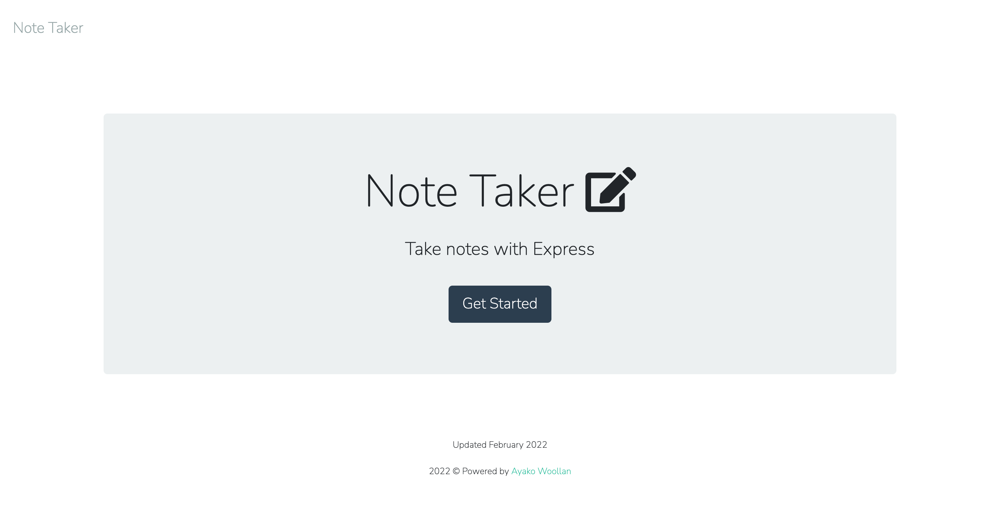
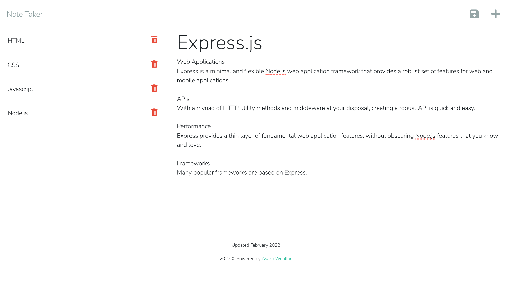

[](https://opensource.org/licenses/MIT)

---
  
# Minimalist Note Taker
<details>
  
<summary>Table of Contents</summary>

  
<ol>
  
<li>
  
<a href="#about-the-project">About The Project</a></li>

  
<ul>
  
<li><a href="#built-with">Built With</a></li>

<li><a href="#usage">Usage</a></>
</ul>

</li>

<li>

<a href="#getting-started">Getting Started</a>

<ul>

<li><a href="#installation">Installation</a>

</ul>

</li>
<li><a href="#license">License</a></>
  
<li><a href="#contact">Contact</a></>
  
</ol>
  
</details>

 ## About The Project


 


 This is an application that can be used to write and save notes. This application uses an Express.js back end and will save and retrieve note data from a JSON file. The users can organize their thoughts and keep track of tasks I need to complete.

<p align = "right">(<a href="#top">back to top</a>)</>

 ## Built With
*  [Node.js](https://nodejs.org/) 
*  [express npm package](https://expressjs.com/) 
*  [uuid npm package](https://www.npmjs.com/package/uuid)  
*  JSON to store notes 
<p align = "right"> (<a href="#top">back to top</a>)</>

## Usage

  Following image shows this application's functionality.
  You can add the notes and text, save it and delete it.
 

 Heroku Link: [Click Here](https://arcane-citadel-56010.herokuapp.com/)

<p align ="right">(<a href="#top">back to top</a>)</>

## Getting Started

To get a local copy up and running follow these simple example steps.

 ## Installation

 The application will be invoked by using the following command:
 Clone the repo
```
git clone git@github.com:ayacomputer/11-Note-Taker.git`
```
 Run this code
 ```
 npm start
 ```

<p align="right">(<a href="#top">back to top</a>)</>

## License

[](https://opensource.org/licenses/MIT)

Distributed under MIT License.

See LICENSE.txt for more information.

<p align ="right">(<a href="#top">back to top</a>)</>

 ## Contact Me

Ayako Woollan - ayako.woollan@gmail.com


GitHub Project Link: [https://github.com/ayacomputer/11-Note-Taker](https://github.com/ayacomputer/11-Note-Taker)

<p align="right">(<a href="#top">back to top</a>)</>
